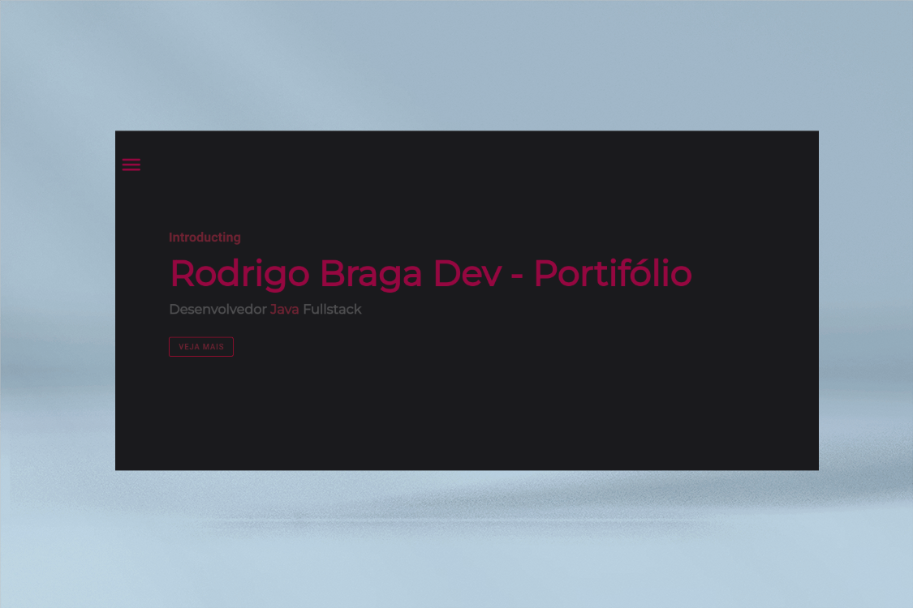

# Portifólio criado utilizando Vuejs, Vuex, and Vuetify.  



### 📋 Clone o projeto na sua maquina abra na sua IDE, e no terminal rode os seguintes comandos :

```
npm install --force

```

### 🔧 Após isso, rode o comando :

```
npm run serve
```


### 🔧 Após isso, abra no seu browser o projeto :

```
http://localhost:8080
```
